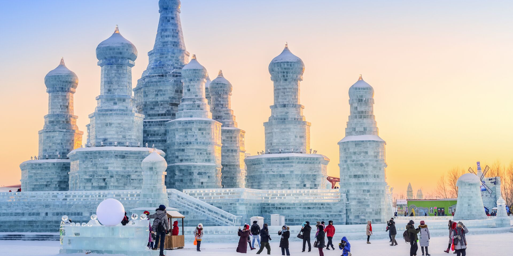
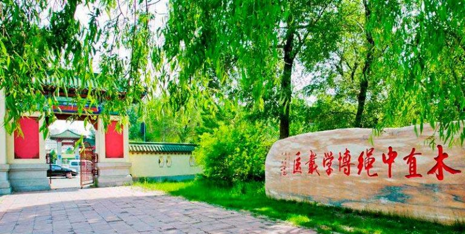

# Introductory 
At beginning, I will briefly introduce myself including my life and academic background.

## Life
I was born in a small town in China, which is Harbin. Here is the picture taken in a winter day in Harbin.

As you could see, my hometown is a city of ice and snow. The average temperature in winter is around -20 degrees Celsius. Also, it is called "Ice city" because of its ice sculptures and winter activities.

Here is a picture of famous ice sculptures.

Because of my hometown's cold weather, I have developed a strong interest in winter sports, especially skiing and skating. You could imagine the view that all the people are skating on the frozen river in winter.

Also, the 9th Asian Winter Games will be held in Harbin 2025. If you are interested in this, you could browse the website below.
[9th Asian Winter Games](https://www.harbin2025.com/english/index.html)

## Academic Background

I graduated from Harbin Medical University, majoring in Clinical Medicine. Here is a corner of my medical school.

During five years in medical school, I have participated in rotations between different departments and gained lots of clinical experience. In the third year around, I gradually felt interested in the field of epidemiology and public health. During the following years, I have done some research about chronic disease interventions and health policy analysis.
If you are interested in my research, you could see the section "experience" in upper right corner of this webpage.

